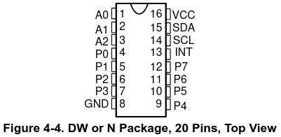
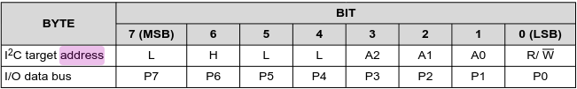

# MB2 i2c gpio expander

[Embedded Hal Docs](https://docs.rs/embedded-hal/latest/embedded_hal/i2c/index.html)
``` Rust
use embedded_hal::i2c::{I2c, Error};

const ADDR: u8 = 0x15;
pub struct TemperatureSensorDriver<I2C> {
    i2c: I2C,
}

impl<I2C: I2c> TemperatureSensorDriver<I2C> {
    pub fn new(i2c: I2C) -> Self {
        Self { i2c }
    }

    pub fn read_temperature(&mut self) -> Result<u8, I2C::Error> {
        let mut temp = [0];
        self.i2c.write_read(ADDR, &[TEMP_REGISTER], &mut temp)?;
        Ok(temp[0])
    }
}
```

[TI GPIO expander data sheet](https://www.ti.com/lit/ds/symlink/pcf8574.pdf)



