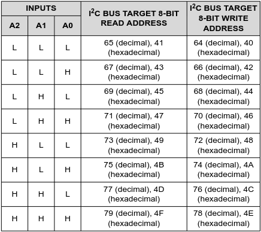
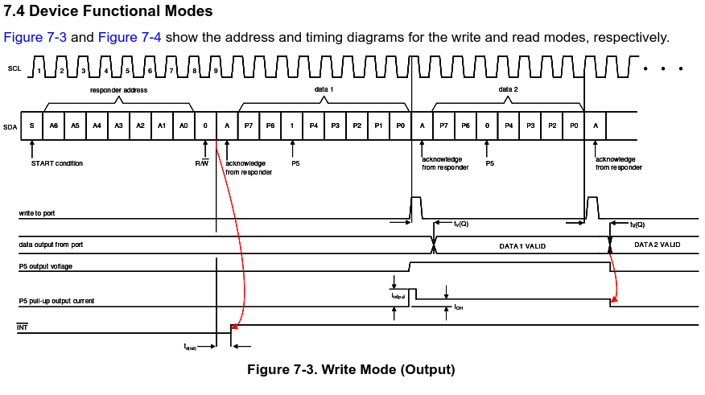

# MB2 I2C gpio expander 

Using the PCF8574P GPIO expander with the Microbit V2 over I2C


# PCF8574  
**Pinout**  
  
[TI GPIO expander data sheet](https://www.ti.com/lit/ds/symlink/pcf8574.pdf)  


# I2C

  
[TI GPIO expander data sheet](https://www.ti.com/lit/ds/symlink/pcf8574.pdf)  

---

  
[TI GPIO expander data sheet](https://www.ti.com/lit/ds/symlink/pcf8574.pdf)  

---

  
[TI GPIO expander data sheet](https://www.ti.com/lit/ds/symlink/pcf8574.pdf)  
---

## Address for the IC 
```
4 set bits
\/   
LHLL LLL (A2 A1 A0 LLL)
     /\
     3 config bits
Total 7 bit address

0100 000 : 0x20
```

## Set a specific pin


The pin data uses `big-endian` bit ordering 7 -> 0  
| P7 | P6 | P5 | P4 | P3 | P2 | P1 | P0 |


---

**Setting P5 high**  


---

### Setting a single pin
 |Pin \# | binary | hex |
 |---|---|---|
 | 0 | 0000 0001 | 0x01 |
 | 1 | 0000 0010 | 0x02 |
 | 2 | 0000 0100 | 0x04 |
 | 3 | 0000 1000 | 0x08 |
 | 4 | 0001 0000 | 0x10 |
 | 5 | 0010 0000 | 0x20 |
 | 6 | 0100 0000 | 0x40 |
 | 7 | 1000 0000 | 0x80 |

### To set multiple pins
 |Pin \# | binary | hex | sum |
 |---|---|---|---|
 | 0 & 1 | 0000 0011 | 0x01 + 0x02 | 0x03 |
 | 1 & 6 | 0100 0010 | 0x02 + 0x40 | 0x42 |

## Example of using embbedded hal with i2c
[Embedded Hal i2c Docs](https://docs.rs/embedded-hal/latest/embedded_hal/i2c/index.html)
``` Rust
use embedded_hal::i2c::{I2c, Error};

const ADDR: u8 = 0x15;
pub struct TemperatureSensorDriver<I2C> {
    i2c: I2C,
}

impl<I2C: I2c> TemperatureSensorDriver<I2C> {
    pub fn new(i2c: I2C) -> Self {
        Self { i2c }
    }

    pub fn read_temperature(&mut self) -> Result<u8, I2C::Error> {
        let mut temp = [0];
        self.i2c.write_read(ADDR, &[TEMP_REGISTER], &mut temp)?;
        Ok(temp[0])
    }
}
```

[GIF of cycling led](https://github.com/tmpk13/mb2-i2c-gpio/blob/main/imgs/PXL_20260207_014600567~22.gif)

<!-- 

 |\# | binary |
 |---|---|
 | 0 | xxxx xxx1 |
 | 1 | xxxx xx1x |
 | 2 | xxxx x1xx |
 | 3 | xxxx 1xxx |
 | 4 | xxx1 xxxx |
 | 5 | xx1x xxxx |
 | 6 | x1xx xxxx |
 | 7 | 1xxx xxxx | -->

